# SwarmSDK Architecture Flow

This document provides a comprehensive flowchart showing how SwarmSDK, SwarmCLI, and SwarmMemory work together.

## Complete System Flow

```mermaid
flowchart TB
    subgraph "Entry Points"
        CLI["CLI: swarm run config.yml -p 'task'"]
        SDK_DSL["SDK: SwarmSDK.build { }"]
        SDK_YAML["SDK: SwarmSDK.load_file(path)"]
        SDK_YAML_STR["SDK: SwarmSDK.load(yaml, base_dir:)"]
        SDK_VALIDATE["SDK: SwarmSDK.validate(yaml)"]
    end

    subgraph "SwarmCLI Layer"
        CLI_START["CLI.start (Thor)"]
        CLI_CMDS["Commands::Run"]
        CONFIG_LOADER["ConfigLoader"]
        REPL["InteractiveREPL"]
        FORMATTER["HumanFormatter/JsonFormatter"]
    end

    subgraph "Configuration Layer"
        BUILDER["Swarm::Builder<br/>(DSL parser)"]
        CONFIGURATION["Configuration<br/>(YAML parser)"]
        MARKDOWN["MarkdownParser<br/>(agent files)"]
        VALIDATE_FLOW["Validation<br/>(error parsing)"]
    end

    subgraph "Core SwarmSDK Layer"
        SWARM["Swarm Instance"]
        AGENT_DEF["Agent::Definition<br/>(validation, system prompts)"]
        SWARM_EXEC["Swarm.execute(prompt)"]
        HOOKS_ADAPTER["Hooks::Adapter<br/>(YAML → Ruby hooks)"]
    end

    subgraph "Agent Initialization (5-Pass)"
        INIT["AgentInitializer"]
        PASS1["Pass 1: Create Agent::Chat<br/>+ ToolConfigurator<br/>+ McpConfigurator"]
        PASS2["Pass 2: Register<br/>delegation tools"]
        PASS3["Pass 3: Setup<br/>Agent::Context"]
        PASS4["Pass 4: Configure<br/>hook system"]
        PASS5["Pass 5: Apply<br/>YAML hooks"]
    end

    subgraph "Agent Execution Layer"
        LEAD_AGENT["Lead Agent::Chat"]
        AGENT_ASK["Agent::Chat.ask(prompt)"]
        HOOK_INTEGRATION["HookIntegration<br/>(user_prompt hooks)"]
        RUBY_LLM["RubyLLM::Chat<br/>(LLM API calls)"]
        RATE_LIMIT["Rate Limiting<br/>(Global + Local Semaphores)"]
    end

    subgraph "Tool Execution Layer"
        TOOL_EXEC["Parallel Tool Execution<br/>(Async fibers)"]
        TOOL_HOOKS["Pre/Post Tool Hooks"]
        TOOL_PERMS["Permissions Wrapper<br/>(path/command validation)"]
        TOOL_INSTANCES["Tool Instances"]
    end

    subgraph "Tool Types"
        FILE_TOOLS["File Tools<br/>(Read, Write, Edit, Glob, Grep)"]
        BASH_TOOL["Bash Tool"]
        DELEGATE_TOOL["Delegation Tools<br/>(call other agents)"]
        PLUGIN_TOOLS["Plugin Tools<br/>(from PluginRegistry)"]
        DEFAULT_TOOLS["Default Tools<br/>(Read, Grep, Glob)"]
        SCRATCHPAD["Scratchpad Tools<br/>(volatile storage)"]
    end

    subgraph "SwarmMemory Plugin"
        MEMORY_PLUGIN["SwarmMemory::Integration::SDKPlugin"]
        MEMORY_STORAGE["Storage<br/>(orchestrates operations)"]
        ADAPTER["FilesystemAdapter<br/>(persistence)"]
        EMBEDDER["InformersEmbedder<br/>(ONNX models)"]
        SEMANTIC_INDEX["SemanticIndex<br/>(FAISS vector search)"]
        MEMORY_TOOLS["Memory Tools<br/>(MemoryWrite, MemoryRead,<br/>MemoryEdit, MemoryGrep, etc.)"]
        LOAD_SKILL["LoadSkill Tool<br/>(dynamic tool swapping)"]
    end

    subgraph "Logging & Events"
        LOG_STREAM["LogStream<br/>(event emitter)"]
        LOG_COLLECTOR["LogCollector<br/>(aggregates events)"]
        LOG_EVENTS["Events: swarm_start, user_prompt,<br/>llm_api_request, llm_api_response,<br/>tool_call, tool_result,<br/>agent_step, agent_stop, swarm_stop"]
    end

    subgraph "Hooks System"
        HOOK_REGISTRY["Hooks::Registry<br/>(named hooks + defaults)"]
        HOOK_EXECUTOR["Hooks::Executor<br/>(chains hooks)"]
        HOOK_SHELL["Hooks::ShellExecutor<br/>(runs shell commands)"]
        HOOK_EVENTS["Events: swarm_start, swarm_stop,<br/>pre_tool_use, post_tool_use,<br/>user_prompt, pre_delegation, etc."]
    end

    subgraph "Node Workflows"
        NODE_ORCH["Workflow<br/>(multi-stage execution)"]
        NODE_CTX["NodeContext<br/>(goto_node, halt_workflow, skip_execution)"]
        TRANSFORMERS["Bash/Ruby Transformers<br/>(input/output transformation)"]
        MINI_SWARMS["Mini-Swarms<br/>(one per node)"]
    end

    subgraph "Result Flow"
        RESULT["Result Object<br/>(content, logs, cost, tokens)"]
        RETURN["Return to User"]
    end

    %% Entry point connections
    CLI --> CLI_START
    CLI_START --> CLI_CMDS
    CLI_CMDS --> CONFIG_LOADER
    CONFIG_LOADER --> SDK_YAML
    CONFIG_LOADER --> SDK_DSL
    SDK_DSL --> BUILDER
    SDK_YAML --> CONFIGURATION
    SDK_YAML_STR --> CONFIGURATION
    SDK_VALIDATE --> VALIDATE_FLOW
    VALIDATE_FLOW --> CONFIGURATION
    VALIDATE_FLOW --> RETURN

    %% Configuration flow
    BUILDER --> AGENT_DEF
    CONFIGURATION --> AGENT_DEF
    CONFIGURATION --> MARKDOWN
    MARKDOWN --> AGENT_DEF
    AGENT_DEF --> SWARM

    %% Hooks adapter
    CONFIGURATION --> HOOKS_ADAPTER
    HOOKS_ADAPTER --> HOOK_REGISTRY

    %% Swarm creation
    SWARM --> AGENT_DEF
    SWARM --> HOOK_REGISTRY

    %% Execution flow
    CLI_CMDS --> REPL
    CLI_CMDS --> SWARM_EXEC
    REPL --> SWARM_EXEC
    SWARM_EXEC --> INIT

    %% Agent initialization
    INIT --> PASS1
    PASS1 --> LEAD_AGENT
    PASS1 --> TOOL_CONFIGURATOR["ToolConfigurator"]
    PASS1 --> MCP_CONFIGURATOR["McpConfigurator"]
    TOOL_CONFIGURATOR --> TOOL_INSTANCES
    TOOL_CONFIGURATOR --> MEMORY_PLUGIN
    MCP_CONFIGURATOR --> MCP_SERVERS["MCP Servers"]
    PASS1 --> PASS2
    PASS2 --> PASS3
    PASS3 --> PASS4
    PASS4 --> PASS5

    %% Lead agent execution
    SWARM_EXEC --> LEAD_AGENT
    LEAD_AGENT --> AGENT_ASK
    AGENT_ASK --> HOOK_INTEGRATION
    HOOK_INTEGRATION --> HOOK_EXECUTOR
    HOOK_INTEGRATION --> RATE_LIMIT
    RATE_LIMIT --> RUBY_LLM

    %% LLM response and tool calling
    RUBY_LLM --> TOOL_EXEC
    TOOL_EXEC --> TOOL_HOOKS
    TOOL_HOOKS --> HOOK_EXECUTOR
    TOOL_HOOKS --> TOOL_PERMS
    TOOL_PERMS --> TOOL_INSTANCES

    %% Tool types
    TOOL_INSTANCES --> FILE_TOOLS
    TOOL_INSTANCES --> BASH_TOOL
    TOOL_INSTANCES --> DELEGATE_TOOL
    TOOL_INSTANCES --> PLUGIN_TOOLS
    TOOL_INSTANCES --> DEFAULT_TOOLS
    TOOL_INSTANCES --> SCRATCHPAD

    %% Delegation
    DELEGATE_TOOL --> AGENT_ASK

    %% Plugin tools
    PLUGIN_TOOLS --> MEMORY_TOOLS
    MEMORY_TOOLS --> MEMORY_STORAGE
    MEMORY_STORAGE --> ADAPTER
    MEMORY_STORAGE --> SEMANTIC_INDEX
    SEMANTIC_INDEX --> EMBEDDER
    MEMORY_PLUGIN --> LOAD_SKILL
    LOAD_SKILL --> LEAD_AGENT

    %% Tool results flow back
    TOOL_INSTANCES --> TOOL_HOOKS
    TOOL_HOOKS --> HOOK_EXECUTOR
    TOOL_HOOKS --> RUBY_LLM

    %% Logging throughout
    SWARM_EXEC --> LOG_STREAM
    AGENT_ASK --> LOG_STREAM
    TOOL_EXEC --> LOG_STREAM
    LOG_STREAM --> LOG_COLLECTOR
    LOG_COLLECTOR --> FORMATTER
    LOG_COLLECTOR --> RESULT

    %% Hook execution
    HOOK_EXECUTOR --> HOOK_REGISTRY
    HOOK_EXECUTOR --> HOOK_SHELL
    HOOK_EXECUTOR --> HOOK_RESULT["Hooks::Result"]
    HOOK_RESULT --> SWARM_EXEC

    %% Node workflows
    SWARM --> NODE_ORCH
    NODE_ORCH --> MINI_SWARMS
    MINI_SWARMS --> TRANSFORMERS
    TRANSFORMERS --> NODE_CTX
    NODE_CTX --> NODE_ORCH
    MINI_SWARMS --> NODE_ORCH
    NODE_ORCH --> RESULT

    %% Final result
    SWARM_EXEC --> HOOK_EXECUTOR
    SWARM_EXEC --> RESULT
    RESULT --> FORMATTER
    FORMATTER --> RETURN

    %% Styling
    classDef entryPoint fill:#e1f5ff,stroke:#0366d6,stroke-width:2px
    classDef cli fill:#fff5e1,stroke:#f9a825,stroke-width:2px
    classDef config fill:#e8f5e9,stroke:#4caf50,stroke-width:2px
    classDef core fill:#fce4ec,stroke:#e91e63,stroke-width:2px
    classDef agent fill:#f3e5f5,stroke:#9c27b0,stroke-width:2px
    classDef tool fill:#e0f2f1,stroke:#009688,stroke-width:2px
    classDef memory fill:#fff3e0,stroke:#ff9800,stroke-width:2px
    classDef logging fill:#e3f2fd,stroke:#2196f3,stroke-width:2px
    classDef hooks fill:#fce4ec,stroke:#e91e63,stroke-width:2px

    class CLI,SDK_DSL,SDK_YAML,SDK_YAML_STR,SDK_VALIDATE entryPoint
    class CLI_START,CLI_CMDS,CONFIG_LOADER,REPL,FORMATTER cli
    class BUILDER,CONFIGURATION,MARKDOWN,VALIDATE_FLOW config
    class SWARM,AGENT_DEF,SWARM_EXEC,HOOKS_ADAPTER,NODE_ORCH,NODE_CTX,TRANSFORMERS,MINI_SWARMS core
    class INIT,PASS1,PASS2,PASS3,PASS4,PASS5,LEAD_AGENT,AGENT_ASK,HOOK_INTEGRATION,RUBY_LLM,RATE_LIMIT agent
    class TOOL_EXEC,TOOL_HOOKS,TOOL_PERMS,TOOL_INSTANCES,FILE_TOOLS,BASH_TOOL,DELEGATE_TOOL,PLUGIN_TOOLS,DEFAULT_TOOLS,SCRATCHPAD,TOOL_CONFIGURATOR,MCP_CONFIGURATOR,MCP_SERVERS tool
    class MEMORY_PLUGIN,MEMORY_STORAGE,ADAPTER,EMBEDDER,SEMANTIC_INDEX,MEMORY_TOOLS,LOAD_SKILL memory
    class LOG_STREAM,LOG_COLLECTOR,LOG_EVENTS logging
    class HOOK_REGISTRY,HOOK_EXECUTOR,HOOK_SHELL,HOOK_EVENTS,HOOK_RESULT hooks
    class RESULT,RETURN core
```



## Key Flow Sequences

### 1. CLI Execution Flow
```
User → CLI → ConfigLoader → SwarmSDK.load_file → Configuration → Swarm → Execute → Formatter → User
```

### 2. SDK Direct Usage Flow
```
Code → SwarmSDK.build/load → Swarm → execute(prompt) → Result → Code
```

### 3. Agent Initialization (Lazy, 5-Pass)
```
Swarm.execute → AgentInitializer →
  Pass 1: Create chats + tools + MCP →
  Pass 2: Delegation tools →
  Pass 3: Contexts →
  Pass 4: Hooks →
  Pass 5: YAML hooks
```

### 4. Agent Execution Flow
```
Agent.ask(prompt) →
  user_prompt hooks →
  llm_api_request event (captures request to LLM) →
  RubyLLM (rate limited) →
  llm_api_response event (captures response from LLM) →
  Tool calls →
    pre_tool_use hooks →
    Tool execution (with permissions) →
    post_tool_use hooks →
  Results to LLM →
  agent_step/agent_stop events
```

### 5. Tool Execution Types
- **File Tools**: Read/Write/Edit/Glob/Grep → PathResolver → Permissions → File I/O
- **Bash Tool**: Execute shell commands
- **Delegation Tools**: Recursively call other Agent::Chat instances
- **Plugin Tools**: PluginRegistry → create_tool → (e.g., MemoryWrite → Storage)
- **Default Tools**: Read, Grep, Glob (file operations and search)
- **Scratchpad Tools**: Volatile shared storage across agents

### 6. Memory Integration Flow
```
MemoryWrite tool →
  Storage.write →
    MetadataExtractor (frontmatter) →
    InformersEmbedder (ONNX) →
    SemanticIndex (FAISS) →
    FilesystemAdapter (JSON persistence)
```

### 7. Logging Flow
```
All components → LogStream.emit → LogCollector →
  [swarm.execute block callback] →
  Formatter → User output
```

### 8. Hooks Flow
```
Event occurs →
  Hooks::Executor →
    Registry (get hooks) →
    Execute (chain hooks) →
    ShellExecutor (for YAML) →
  Hooks::Result (halt/replace/continue) →
  Control flow decision
```

### 9. Node Workflow Flow
```
Workflow.execute →
  Build execution order (topological sort) →
  For each node:
    Input transformer (Bash/Ruby) →
    Create mini-swarm →
    Execute →
    NodeContext (goto_node/halt/skip) →
    Output to next node →
  Final result
```

## Component Responsibilities

### SwarmSDK Core
- **Swarm**: Main orchestrator, agent management, execution lifecycle
- **Configuration**: YAML parsing, validation, agent file loading
- **Agent::Definition**: Configuration validation, system prompt building
- **Agent::Chat**: LLM interaction, tool calling, rate limiting, hooks
- **AgentInitializer**: Complex 5-pass initialization (tools, MCP, delegation, hooks)
- **ToolConfigurator**: Tool registration, creation, permissions wrapping
- **McpConfigurator**: MCP client management, external tool integration
- **Workflow**: Multi-stage workflows with transformers
- **Plugin System**: Extensibility framework (SwarmMemory uses this)

### SwarmCLI
- **CLI**: Thor-based command parser
- **Commands::Run**: Execute swarms (interactive or non-interactive)
- **InteractiveREPL**: Reline-based conversational interface
- **ConfigLoader**: Detects and loads YAML/Ruby DSL files
- **HumanFormatter**: TTY toolkit rendering (Markdown, Box, Spinner, Pastel)
- **JsonFormatter**: Structured JSON output for automation

### SwarmMemory
- **SDKPlugin**: SwarmSDK plugin implementation
- **Storage**: Orchestrates adapter, embedder, semantic index
- **FilesystemAdapter**: JSON-based persistence
- **InformersEmbedder**: Fast local ONNX embeddings
- **SemanticIndex**: FAISS-based vector similarity search
- **Memory Tools**: MemoryWrite, MemoryRead, MemoryEdit, MemoryGrep, MemoryGlob, MemoryDelete, MemoryDefrag
- **LoadSkill**: Dynamic tool loading with semantic discovery

### Supporting Systems
- **Hooks**: Registry → Executor → ShellExecutor (YAML) or Ruby blocks (DSL)
- **Logging**: LogStream → LogCollector → Formatters
- **Permissions**: Path-based (Read/Write) and command-based (Bash) validation
- **Rate Limiting**: Two-level semaphores (global + per-agent)
- **MCP Integration**: RubyLLM::MCP client for external tools

## Data Flow

### Configuration → Swarm
```
YAML/DSL → Configuration/Builder → Agent::Definition[] → Swarm → (lazy) AgentInitializer → Agent::Chat[]
```

### Execution → Result
```
User prompt → Swarm.execute → Hooks → Lead Agent → LLM → Tools → Hooks → Result → User
```

### Memory Operations
```
MemoryWrite → Storage → Embedder → SemanticIndex → Adapter → File system
MemoryGrep → Storage → SemanticIndex.search → Results
```

## Concurrency Model

- **Async Reactor**: All execution within `Async { }` blocks (Fiber scheduler)
- **Global Semaphore**: Limits total concurrent LLM calls across all agents
- **Local Semaphore**: Limits concurrent tool calls per agent
- **Parallel Tool Execution**: Tools execute concurrently within semaphore limits
- **Fiber-Safe Logging**: LogStream designed for concurrent access

## Plugin Architecture

```
Plugin Registration → PluginRegistry
  ↓
Plugin Lifecycle Hooks:
  - on_agent_initialized (create storage, register tools)
  - on_user_message (semantic skill discovery)
  - system_prompt_contribution (add memory guidance)
  - serialize_config (preserve config when cloning)
  ↓
Tool Creation: plugin.create_tool(tool_name, context)
  ↓
Tool execution within Agent::Chat
```
