# SwarmMemory: Comprehensive Technical Reference

**Version:** 2.2.4
**Purpose:** Persistent memory system with semantic search for SwarmSDK agents
**Location:** `lib/swarm_memory/`

---

## Table of Contents

1. [Overview & Architecture](#overview--architecture)
2. [Core Components](#core-components)
3. [Adapters](#adapters)
4. [Embeddings & Search](#embeddings--search)
5. [Memory Tools](#memory-tools)
6. [Optimization System](#optimization-system)
7. [Integration with SwarmSDK](#integration-with-swarmsdk)
8. [DSL & Configuration](#dsl--configuration)
9. [CLI Commands](#cli-commands)
10. [Skills System](#skills-system)
11. [Data Flow & Lifecycle](#data-flow--lifecycle)
12. [Testing Strategy](#testing-strategy)

---

## Overview & Architecture

### What SwarmMemory Does

SwarmMemory provides **hierarchical persistent memory with semantic search** for SwarmSDK agents. It enables agents to:

- **Store knowledge** across sessions in 4 fixed categories: `concept/`, `fact/`, `skill/`, `experience/`
- **Search semantically** using ONNX-based embeddings (Informers gem)
- **Load skills** that dynamically swap agent tools
- **Optimize memory** through defragmentation, duplicate detection, and quality analysis
- **Maintain isolation** - each agent has its own memory storage

### High-Level Architecture

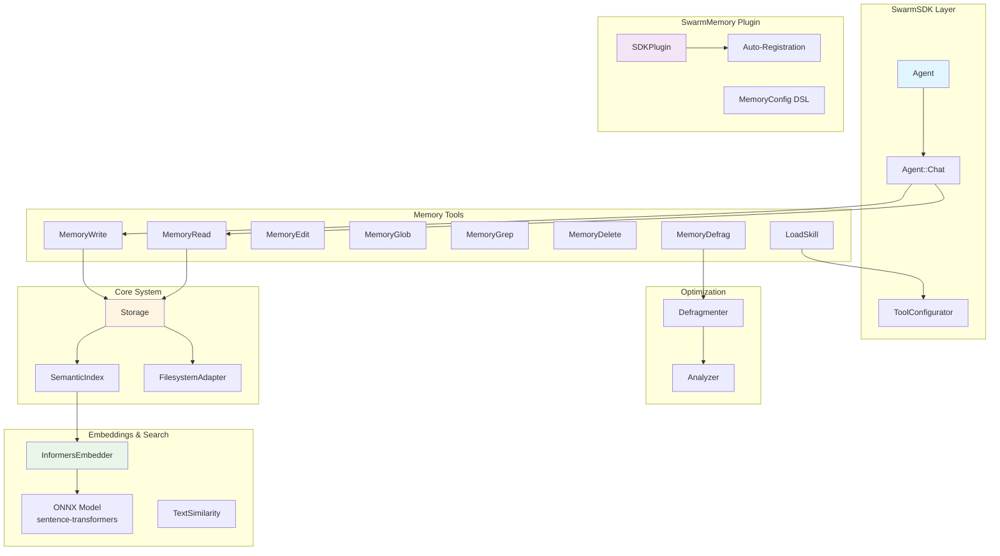

### Key Design Principles

1. **Single Process** - No inter-process communication, all in-memory
2. **Fiber-Safe Concurrency** - Uses `Async::Semaphore` for safe concurrent access
3. **Plugin Architecture** - Integrates with SwarmSDK via plugin system
4. **Adapter Pattern** - Storage backends are pluggable (filesystem, Redis, etc.)
5. **Hybrid Search** - Combines semantic similarity + keyword matching
6. **Tool Isolation** - Each tool is self-contained with clear responsibilities
7. **Zero Configuration** - Works out-of-box with sensible defaults

---

## Core Components

### 1. Entry

**File:** `lib/swarm_memory/core/entry.rb`

The fundamental data structure representing a single memory entry.

```ruby
Entry = Struct.new(
  :content,      # String - Markdown content
  :title,        # String - Brief description
  :updated_at,   # Time - Last modification
  :size,         # Integer - Bytes
  :embedding,    # Array<Float> - 384-dim vector (optional)
  :metadata,     # Hash - Structured metadata
  keyword_init: true
)
```

**Key Methods:**
- `embedded?` - Checks if entry has an embedding vector
- `has_metadata?` - Checks if entry has metadata

**Metadata Structure:**
```ruby
{
  "type" => "concept|fact|skill|experience",  # REQUIRED
  "confidence" => "high|medium|low",          # Default: medium
  "tags" => ["keyword1", "keyword2"],         # Searchable keywords
  "related" => ["memory://path/to/entry.md"], # Cross-references
  "domain" => "programming/ruby",             # Category
  "source" => "user|documentation|...",       # Origin
  "tools" => ["Read", "Edit"],                # For skills only
  "permissions" => { ... }                    # For skills only
}
```

---

### 2. Storage

**File:** `lib/swarm_memory/core/storage.rb`

High-level orchestrator for all storage operations. Coordinates adapter, embedder, and semantic index.

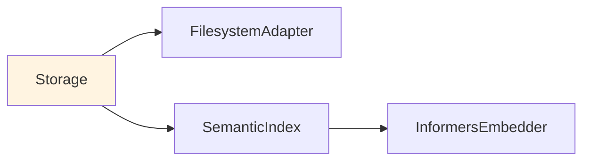

**Initialization:**
```ruby
adapter = Adapters::FilesystemAdapter.new(directory: ".swarm/memory")
embedder = Embeddings::InformersEmbedder.new
storage = Storage.new(adapter: adapter, embedder: embedder)
```

**Key Methods:**

| Method | Purpose | Returns |
|--------|---------|---------|
| `write(file_path:, content:, title:, metadata:)` | Create/update entry | Entry |
| `read(file_path:)` | Read content only | String |
| `read_entry(file_path:)` | Read full entry with metadata | Entry |
| `delete(file_path:)` | Remove entry | void |
| `list(prefix: nil)` | List all entries | Array<Hash> |
| `glob(pattern:)` | Pattern matching | Array<Hash> |
| `grep(pattern:, options...)` | Content search | Array<Hash> |

**Embedding Generation:**

When writing an entry with embedder enabled, Storage:

1. Builds **searchable text** (not full content):
   - Title (most important)
   - Tags (critical keywords)
   - Domain (context)
   - First paragraph (summary, configurable length)

2. Generates **384-dimension vector** via Informers

3. Emits **LogStream event** for observability:
   ```ruby
   SwarmSDK::LogStream.emit(
     type: "memory_embedding_generated",
     file_path: normalized_path,
     searchable_text: text,
     metadata_tags: tags
   )
   ```

**Searchable Text Construction:**

```ruby
# Environment variable control:
SWARM_MEMORY_EMBEDDING_MAX_CHARS=1200  # Default
SWARM_MEMORY_EMBEDDING_MAX_CHARS=-1    # Unlimited
SWARM_MEMORY_EMBEDDING_MAX_CHARS=500   # Custom

# Builds: Title + Tags + Domain + First Paragraph
parts = [
  "Title: #{title}",
  "Tags: #{tags.join(", ")}",
  "Domain: #{domain}",
  "Summary: #{first_paragraph}"  # Capped at max_chars
]
```

---

### 3. SemanticIndex

**File:** `lib/swarm_memory/core/semantic_index.rb`

Provides **hybrid search** combining semantic similarity and keyword matching.

**Hybrid Scoring Formula:**
```ruby
hybrid_score = (semantic_weight * semantic_similarity) +
               (keyword_weight * keyword_score)

# Default: 50/50 (discovered via systematic evaluation)
# Configurable via ENV:
SWARM_MEMORY_SEMANTIC_WEIGHT=0.5  # Default
SWARM_MEMORY_KEYWORD_WEIGHT=0.5   # Default
```

**Search Process:**

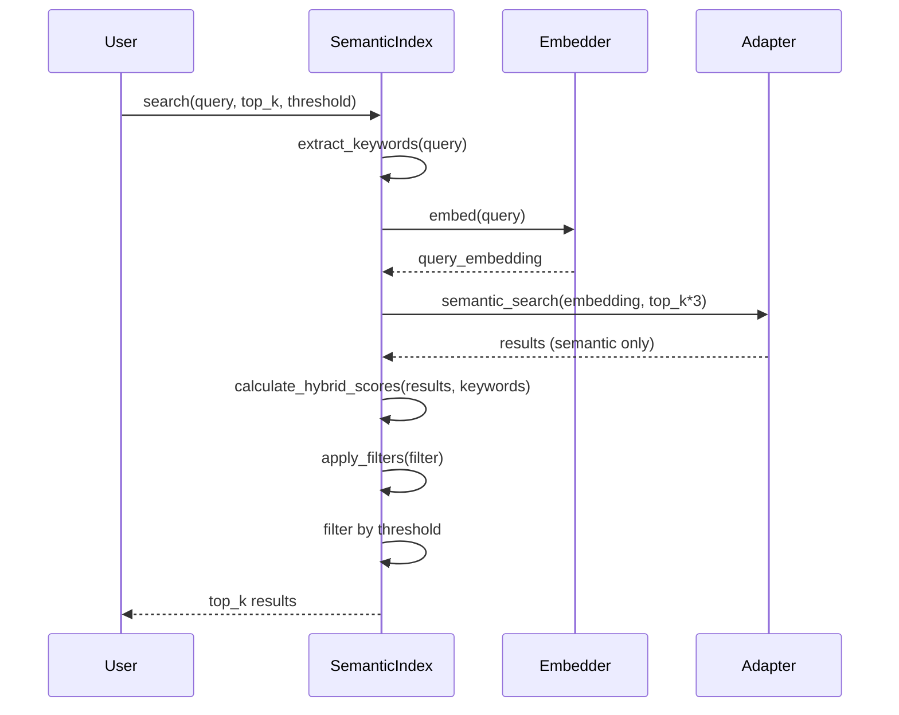

**Keyword Matching:**
- Extracts keywords from query (removes stop words)
- Matches against entry **tags** (fuzzy matching)
- Normalizes score to 0-1 scale
- Uses `min(keywords.size, 5)` to avoid penalizing long queries

**Key Methods:**
- `search(query:, top_k:, threshold:, filter:)` - Hybrid search
- `find_similar(embedding:, top_k:, threshold:)` - Embedding-based only

---

### 4. PathNormalizer

**File:** `lib/swarm_memory/core/path_normalizer.rb`

Validates and normalizes memory paths for safety and consistency.

**Validation Rules:**
```ruby
INVALID_PATTERNS = [
  %r{\A/},        # No absolute paths
  /\.\./,         # No parent references
  %r{//},         # No double slashes
  /\A\s/,         # No leading whitespace
  /\s\z/,         # No trailing whitespace
  /[<>:"|?*]/     # No invalid filesystem chars
]
```

**Normalization:**
```ruby
# Input:  "//concepts///ruby//classes.md"
# Output: "concepts/ruby/classes.md"

# Input:  "../secrets/api-key.md"
# Raises: ArgumentError (security violation)
```

---

### 5. StorageReadTracker

**File:** `lib/swarm_memory/core/storage_read_tracker.rb`

**Thread-safe** global tracker enforcing **read-before-edit** pattern.

```ruby
# Each agent has independent read history
@read_entries = {
  agent_1: #<Set: {"concept/ruby.md", "fact/john.md"}>,
  agent_2: #<Set: {"skill/debug.md"}>
}
```

**Purpose:**
- Prevents editing entries without reading them first
- Ensures agents have current content for exact matching
- Thread-safe with `Mutex`

**API:**
```ruby
StorageReadTracker.register_read(:agent_1, "concept/ruby.md")
StorageReadTracker.entry_read?(:agent_1, "concept/ruby.md") # => true
StorageReadTracker.clear(:agent_1)  # Clear agent's history
```

---

### 6. FrontmatterParser & MetadataExtractor

**Files:**
- `lib/swarm_memory/core/frontmatter_parser.rb`
- `lib/swarm_memory/core/metadata_extractor.rb`

Parse YAML frontmatter from markdown content.

**Format:**
```markdown
---
type: concept
confidence: high
tags: [ruby, oop]
---

# Ruby Classes

Content here...
```

**Parsing:**
```ruby
parsed = FrontmatterParser.parse(content)
# => {
#   frontmatter: { type: "concept", confidence: "high", ... },
#   body: "# Ruby Classes\n\nContent...",
#   error: nil
# }
```

**Quality Scoring:**
```ruby
score = MetadataExtractor.quality_score(content)
# Scoring:
# - Has type: 20 points
# - Has confidence: 20 points
# - Has tags: 15 points
# - Has related links: 15 points
# - Has domain: 10 points
# - Has last_verified: 10 points
# - Confidence=high: +10 bonus
# Max: 100 points
```

---

## Adapters

### Base Adapter Interface

**File:** `lib/swarm_memory/adapters/base.rb`

Abstract base class defining the storage adapter interface.

**Required Methods:**
```ruby
class MyAdapter < Base
  def write(file_path:, content:, title:, embedding:, metadata:)
    # Store entry
  end

  def read(file_path:)
    # Return content string
  end

  def read_entry(file_path:)
    # Return full Entry object
  end

  def delete(file_path:)
    # Remove entry
  end

  def list(prefix: nil)
    # Return array of entry metadata
  end

  def glob(pattern:)
    # Pattern matching
  end

  def grep(pattern:, case_insensitive:, output_mode:, path:)
    # Content search
  end

  def semantic_search(embedding:, top_k:, threshold:)
    # Semantic similarity search
  end

  def clear
    # Delete all entries
  end

  def total_size
    # Total bytes
  end

  def size
    # Entry count
  end
end
```

**Size Limits:**
```ruby
MAX_ENTRY_SIZE = 3_000_000   # 3MB per entry
MAX_TOTAL_SIZE = 100_000_000_000 # 100GB total
```

---

### FilesystemAdapter

**File:** `lib/swarm_memory/adapters/filesystem_adapter.rb`

Real filesystem storage using `.md/.yml/.emb` file triplets.

**On-Disk Structure:**
```
.swarm/memory/
├── concept/
│   └── ruby/
│       ├── classes.md       # Content (markdown)
│       ├── classes.yml      # Metadata (title, tags, etc.)
│       └── classes.emb      # Embedding (binary float array)
├── fact/
│   ├── api.md
│   ├── api.yml
│   └── api.emb
├── skill/
│   └── debugging/
│       ├── api-errors.md
│       ├── api-errors.yml
│       └── api-errors.emb
└── .lock                    # File lock for cross-process sync
```

**Key Features:**

1. **Hierarchical Storage** - Paths stored as actual directories (not flattened)

2. **Cross-Process Locking** - Uses `flock` for exclusive write access:
   ```ruby
   def with_write_lock
     File.open(@lock_file_path, File::RDWR | File::CREAT) do |lock_file|
       lock_file.flock(File::LOCK_EX)  # Block until acquired
       yield
     ensure
       lock_file.flock(File::LOCK_UN)
     end
   end
   ```

3. **Fiber-Safe Concurrency** - `Async::Semaphore` for in-process:
   ```ruby
   @semaphore = Async::Semaphore.new(1)

   @semaphore.acquire do
     # Exclusive access
   end
   ```

4. **In-Memory Index** - Built on boot for fast lookups:
   ```ruby
   @index = {
     "concept/ruby/classes.md" => {
       disk_path: "concept/ruby/classes",
       title: "Ruby Classes",
       size: 1024,
       updated_at: Time.now
     }
   }
   ```

5. **Hit Tracking** - Tracks access count in `.yml` files:
   ```yaml
   # concept/ruby/classes.yml
   title: Ruby Classes
   hits: 42  # Incremented on read
   ```

6. **Stub/Redirect System** - For merged/moved entries:
   ```markdown
   # merged → concept/ruby/advanced-classes.md

   This entry was merged into concept/ruby/advanced-classes.md
   ```

7. **Virtual Entries** - Built-in skills that don't consume storage:
   ```ruby
   VIRTUAL_ENTRIES = {
     "skill/meta/deep-learning.md" => "meta/deep-learning"
   }
   ```

**Semantic Search Implementation:**
```ruby
def semantic_search(embedding:, top_k:, threshold:)
  results = []

  @index.each do |logical_path, index_data|
    emb_file = "#{index_data[:disk_path]}.emb"
    next unless File.exist?(emb_file)

    entry_embedding = File.read(emb_file).unpack("f*")
    similarity = cosine_similarity(embedding, entry_embedding)
    next if similarity < threshold

    results << {
      path: logical_path,
      similarity: similarity,
      title: index_data[:title],
      metadata: load_metadata(logical_path)
    }
  end

  results.sort_by { |r| -r[:similarity] }.take(top_k)
end
```

**Glob Implementation:**
```ruby
# Uses native Ruby Dir.glob with hierarchical paths
def glob(pattern:)
  # Smart normalization:
  # "fact/**"  → "fact/**/*.md"  (recursive)
  # "fact/*"   → "fact/*.md"     (direct children)
  # "fact"     → "fact.md"       (specific file)

  Dir.glob(File.join(@directory, normalized_pattern))
    .reject { |f| stub_file?(f) }
    .map { |f| build_entry_metadata(f) }
end
```

**Grep Implementation:**
```ruby
def grep(pattern:, case_insensitive:, output_mode:, path:)
  regex = Regexp.new(pattern, case_insensitive ? Regexp::IGNORECASE : 0)

  case output_mode
  when "files_with_matches"
    # Fast path: search .yml first (metadata), then .md
    grep_files_with_matches(regex, path)
  when "content"
    # Return matching lines with line numbers
    grep_with_content(regex, path)
  when "count"
    # Return match counts per file
    grep_with_count(regex, path)
  end
end
```

---

## Embeddings & Search

### InformersEmbedder

**File:** `lib/swarm_memory/embeddings/informers_embedder.rb`

Fast, local embedding generation using ONNX models via the Informers gem.

**Key Specifications:**
```ruby
DEFAULT_MODEL = "sentence-transformers/multi-qa-MiniLM-L6-cos-v1"
EMBEDDING_DIMENSIONS = 384
MODEL_SIZE = ~90MB (unquantized ONNX)
```

**Model Options:**
```ruby
# Q&A optimized (default, 512 token context)
SWARM_MEMORY_EMBEDDING_MODEL=sentence-transformers/multi-qa-MiniLM-L6-cos-v1

# General purpose (256 token context)
SWARM_MEMORY_EMBEDDING_MODEL=sentence-transformers/all-MiniLM-L6-v2
```

**Usage:**
```ruby
embedder = InformersEmbedder.new

# Check if cached locally
embedder.cached? # => false

# Preload model (triggers download if needed)
embedder.preload!  # Downloads ~90MB on first call

# Generate embeddings
vector = embedder.embed("This is a test sentence")
# => [0.123, -0.456, 0.789, ...] (384 dimensions)

# Batch generation
vectors = embedder.embed_batch(["text1", "text2", "text3"])
# => [[...], [...], [...]]
```

**Cache Location:**
```ruby
Informers.cache_dir
# => "~/.cache/huggingface/hub" (default)

# Custom cache:
Informers.cache_dir = "/custom/path"
```

---

### TextSimilarity

**File:** `lib/swarm_memory/search/text_similarity.rb`

Provides similarity calculations for text and vectors.

**Jaccard Similarity (Word Overlap):**
```ruby
# J(A,B) = |A ∩ B| / |A ∪ B|
sim = TextSimilarity.jaccard("ruby classes", "ruby modules")
# => 0.33 (1 shared word out of 3 unique)
```

**Cosine Similarity (Vector Angle):**
```ruby
# cos(θ) = (A · B) / (||A|| * ||B||)
vec1 = [0.1, 0.2, 0.3]
vec2 = [0.2, 0.3, 0.4]
sim = TextSimilarity.cosine(vec1, vec2)
# => 0.99 (very similar)
```

**Tokenization:**
```ruby
# Lowercase, alphanumeric only, min 3 chars, remove stop words
tokenize("The quick brown fox") # => #<Set: {"quick", "brown", "fox"}>
```

---

### Semantic Search Architecture

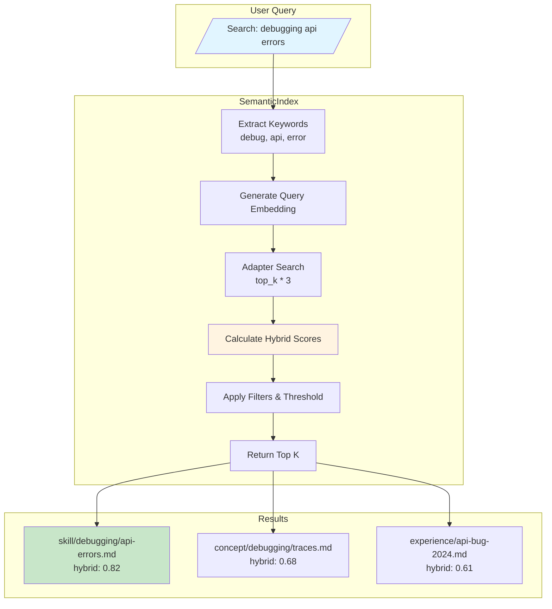

**Hybrid Scoring Details:**
```ruby
# For each result:
semantic_score = cosine_similarity(query_emb, entry_emb)  # 0-1

# Keyword matching (fuzzy on tags):
keyword_score = matches / min(keywords.size, 5)  # 0-1

# Hybrid (default 50/50):
hybrid_score = (0.5 * semantic_score) + (0.5 * keyword_score)

# Results sorted by hybrid_score descending
```

**Adaptive Thresholds:**
```ruby
# Short queries (< 10 words) use lower threshold
word_count = query.split.size
word_cutoff = ENV["SWARM_MEMORY_ADAPTIVE_WORD_CUTOFF"] || "10"

threshold = if word_count < word_cutoff
  ENV["SWARM_MEMORY_DISCOVERY_THRESHOLD_SHORT"] || "0.25"  # Lower
else
  ENV["SWARM_MEMORY_DISCOVERY_THRESHOLD"] || "0.35"        # Normal
end
```

---

## Memory Tools

All tools inherit from `RubyLLM::Tool` and are registered with SwarmSDK's plugin system.

### Shared Module: TitleLookup

**File:** `lib/swarm_memory/tools/title_lookup.rb`

A shared module included by MemoryRead, MemoryGrep, and MemoryGlob to provide consistent title lookups for memory entries.

**Methods:**
```ruby
# Look up the title of a memory entry
def lookup_title(path)
  # Returns the title if found, nil otherwise
end

# Format a memory path with its title
def format_memory_path_with_title(path)
  # Returns: 'memory://path "Title"' or 'memory://path' if no title
end
```

**Usage in Tools:**
- **MemoryRead**: Formats related memory paths in the system-reminder section
- **MemoryGrep**: Includes titles in `files_with_matches` output mode
- **MemoryGlob**: Shows titles next to each matching entry

---

### 1. MemoryWrite

**File:** `lib/swarm_memory/tools/memory_write.rb`

Creates new memory entries with structured metadata.

**Required Parameters:**
```ruby
file_path:  "concept/ruby/classes.md"  # Where to store
content:    "Pure markdown content"    # No frontmatter
title:      "Ruby Classes"             # Brief description
type:       "concept"                  # concept|fact|skill|experience
tags:       '["ruby", "oop"]'          # JSON string of keywords
related:    '["memory://..."]'         # JSON string of cross-refs
domain:     "programming/ruby"         # Category
```

**Optional Parameters:**
```ruby
confidence: "high|medium|low"          # Default: medium
source:     "user|documentation|..."   # Default: user
tools:      '["Read", "Edit"]'         # For skills only
permissions: { ... }                   # For skills only
```

**Content Length Limit:**
```ruby
WORD_LIMIT = 250

# If exceeded, tool returns error:
"Content exceeds 250-word limit (X words).
Extract key entities and split into multiple memories."
```

**Validation:**
```ruby
# Path must start with one of 4 categories:
- concept/
- fact/
- skill/
- experience/

# INVALID: documentation/, reference/, notes/, etc.
```

---

### 2. MemoryRead

**File:** `lib/swarm_memory/tools/memory_read.rb`

Reads memory entries with line-numbered content. Uses the `TitleLookup` module for formatting related memory paths with their titles.

**Output Format (Plain Text with Line Numbers):**
```
     1 # Ruby Classes
     2
     3 Classes in Ruby are blueprints for objects.
     4 They encapsulate data and behavior together.

<system-reminder>
Related memories that may provide additional context:
- memory://concept/ruby/modules.md "Ruby Modules"
- memory://concept/ruby/inheritance.md "Ruby Inheritance"
</system-reminder>
```

**Output Structure:**
- Content is displayed with 6-character right-justified line numbers followed by a space
- If the entry has `related` paths in metadata, a `<system-reminder>` section is appended
- Related memory paths include their titles in quotes (via `TitleLookup` module)
- If a related memory's title cannot be found, the path is shown without quotes

**Side Effect:**
```ruby
# Registers read in StorageReadTracker
Core::StorageReadTracker.register_read(agent_name, file_path, content)
```

---

### 3. MemoryEdit

**File:** `lib/swarm_memory/tools/memory_edit.rb`

Exact string replacement (like Edit tool for files).

**Parameters:**
```ruby
file_path:   "concept/ruby/classes.md"
old_string:  "def initialize"         # Exact match required
new_string:  "def setup"              # Replacement
replace_all: false                    # Replace all occurrences?
```

**Enforcement:**
```ruby
# MUST read entry first:
unless StorageReadTracker.entry_read?(agent_name, file_path)
  return error("Cannot edit without reading first")
end

# old_string must exist:
unless content.include?(old_string)
  return error("old_string not found")
end

# old_string must be unique (unless replace_all=true):
if content.scan(old_string).count > 1 && !replace_all
  return error("Found N occurrences. Use replace_all or make unique.")
end
```

---

### 4. MemoryGlob

**File:** `lib/swarm_memory/tools/memory_glob.rb`

Pattern-based file discovery (like filesystem glob).

**Glob Syntax:**
```ruby
# Single level (direct children only):
"fact/*"        # → fact/*.md (not nested)

# Recursive (all descendants):
"fact/**"       # → fact/**/*.md (all nested)
"fact/**/*"     # → same as above

# Specific pattern:
"skill/debug*"  # → skill/debug*.md
"**/api-*.md"   # → any path ending with api-*.md
```

**Output Format:**
```
Memory entries matching 'concept/ruby/*' (2 entries):
- memory://concept/ruby/classes.md "Ruby Classes" (1.2KB)
- memory://concept/ruby/modules.md "Ruby Modules" (856B)
```

**Examples:**
```ruby
MemoryGlob(pattern: "concept/ruby/*")
# Returns entries with paths, titles, and sizes

MemoryGlob(pattern: "skill/**")
# Returns: All skills recursively with titles

MemoryGlob(pattern: "**/*")
# Returns: All entries across all categories
```

**Limits:**
```ruby
MAX_RESULTS = 500  # Truncates with system reminder if exceeded
```

---

### 5. MemoryGrep

**File:** `lib/swarm_memory/tools/memory_grep.rb`

Regex-based content search.

**Parameters:**
```ruby
pattern:          "TODO|FIXME"              # Regex pattern
path:             "concept/"                # Optional filter
case_insensitive: true                      # Default: false
output_mode:      "files_with_matches"      # See below
```

**Output Modes:**

1. **files_with_matches** (default) - Paths with titles
   ```
   Memory entries matching 'Ruby' (2 entries):
   - memory://concept/ruby/classes.md "Ruby Classes"
   - memory://concept/ruby/modules.md "Ruby Modules"
   ```
2. **content** - Matching lines with line numbers
   ```
   memory://concept/ruby/classes.md:
   2: Ruby classes are blueprints...
   (1 match in 1 entry)
   ```
3. **count** - Match counts per file
   ```
   3 total matches in 2 entries:
   - memory://concept/ruby/classes.md: 2 matches
   - memory://concept/ruby/modules.md: 1 match
   ```

**Path Filtering:**
```ruby
# Directory filter:
path: "concept/"           # All in concept/

# Subdirectory filter:
path: "fact/api"           # Only fact/api/* (not fact/api-design/)

# Specific file:
path: "skill/debug.md"     # Just that file
```

---

### 6. MemoryDelete

**File:** `lib/swarm_memory/tools/memory_delete.rb`

Permanently removes entries.

**Usage:**
```ruby
MemoryDelete(file_path: "experience/temp-experiment.md")
```

**Warning:** Deletion is permanent. Consider using `MemoryDefrag` to identify candidates first.

---

### 7. MemoryDefrag

**File:** `lib/swarm_memory/tools/memory_defrag.rb`

Analyzes and optimizes memory storage.

**Actions:**

#### Read-Only Analysis

```ruby
# 1. Overall health report
MemoryDefrag(action: "analyze")

# 2. Find duplicates (similarity > threshold)
MemoryDefrag(action: "find_duplicates", similarity_threshold: 0.85)

# 3. Find low-quality entries
MemoryDefrag(action: "find_low_quality", confidence_filter: "low")

# 4. Find old, unused entries
MemoryDefrag(action: "find_archival_candidates", age_days: 90)

# 5. Find related entries that should be linked
MemoryDefrag(
  action: "find_related",
  min_similarity: 0.60,  # Lower bound
  max_similarity: 0.85   # Upper bound (above = duplicates)
)
```

#### Active Optimization (Modifies Memory)

```ruby
# 6. Create bidirectional links between related entries
MemoryDefrag(action: "link_related", dry_run: true)   # Preview
MemoryDefrag(action: "link_related", dry_run: false)  # Execute

# 7. Merge duplicate entries
MemoryDefrag(
  action: "merge_duplicates",
  similarity_threshold: 0.85,
  merge_strategy: "keep_newer",  # or "keep_larger" or "combine"
  dry_run: true
)

# 8. Delete old stub files
MemoryDefrag(
  action: "cleanup_stubs",
  age_days: 30,
  max_hits: 3,  # Max access count to delete
  dry_run: false
)

# 9. Delete low-value entries
MemoryDefrag(
  action: "compact",
  min_quality_score: 20,
  min_age_days: 30,
  max_hits: 0,
  dry_run: false
)

# 10. Full optimization workflow
MemoryDefrag(action: "full", dry_run: true)  # Preview all
```

**Safety:** All active operations default to `dry_run: true`

---

### 8. LoadSkill

**File:** `lib/swarm_memory/tools/load_skill.rb`

Loads a skill from memory and **dynamically swaps agent tools**.

**Requirements:**
```ruby
# Skill must:
- Be in skill/ hierarchy
- Have type: "skill" in metadata
- Optionally specify tools array
- Optionally specify permissions hash
```

**Tool Swapping Process:**
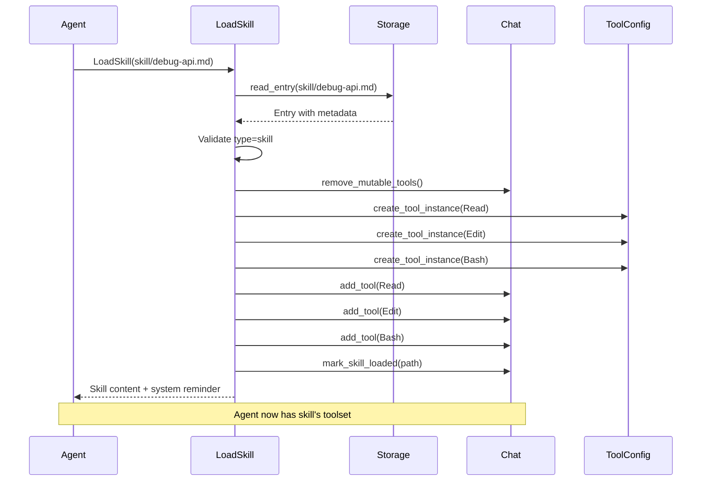

**Immutable Tools:**
```ruby
# These tools NEVER removed during skill loading:
- MemoryWrite, MemoryRead, MemoryEdit
- MemoryDelete, MemoryGlob, MemoryGrep, MemoryDefrag
- LoadSkill (self)
```

**System Reminder:**
```
<system-reminder>
Your available tools have been updated.

New tools loaded from skill:
  - Read
  - Edit
  - Bash

Your complete toolset is now:
  - Bash
  - Edit
  - LoadSkill
  - MemoryEdit
  - MemoryRead
  - MemoryWrite
  - Read

Only use tools from this list.
</system-reminder>
```

---

## Optimization System

### Analyzer

**File:** `lib/swarm_memory/optimization/analyzer.rb`

Generates health metrics and statistics.

**Health Score Components (0-100):**
```ruby
# Frontmatter coverage (30 points)
>80% entries: +30
>50% entries: +20
>20% entries: +10

# Tags coverage (20 points)
>60% entries: +20
>30% entries: +10

# Links coverage (20 points)
>40% entries: +20
>20% entries: +10

# Embedding coverage (15 points)
>80% entries: +15
>50% entries: +8

# High confidence ratio (15 points)
>50% entries: +15
>25% entries: +8
```

**Health Report:**
```
# Memory Health Report

## Overview
- Total entries: 42
- Total size: 156.3KB
- Entries with frontmatter: 38 (90%)
- Entries with embeddings: 42 (100%)
- Entries with tags: 35 (83%)
- Entries with related links: 28 (67%)
- Average quality score: 72/100

## By Type
- concept: 15 (36%)
- fact: 18 (43%)
- skill: 6 (14%)
- experience: 3 (7%)

## By Confidence
- high: 25 (60%)
- medium: 13 (31%)
- low: 4 (10%)

## Health Score: 85/100
Excellent - Memory is well-organized and high-quality
```

---

### Defragmenter

**File:** `lib/swarm_memory/optimization/defragmenter.rb`

Performs optimization operations.

**Duplicate Detection:**
```ruby
# Uses both text and semantic similarity:
text_sim = TextSimilarity.jaccard(entry1.content, entry2.content)
semantic_sim = TextSimilarity.cosine(entry1.embedding, entry2.embedding)
similarity = [text_sim, semantic_sim].max

# Pairs above threshold are candidates
```

**Merge Strategies:**

1. **keep_newer** - Keep most recently updated entry
2. **keep_larger** - Keep entry with most content
3. **combine** - Merge content from both entries

**Stub Creation:**
```markdown
# merged → concept/ruby/advanced-classes.md

This entry was merged into concept/ruby/advanced-classes.md
```

**Related Entry Linking:**
```ruby
# Find pairs with 60-85% semantic similarity
# (not duplicates, but related content)

# Creates bidirectional links:
entry1.metadata["related"] << "memory://path/to/entry2.md"
entry2.metadata["related"] << "memory://path/to/entry1.md"
```

---

## Integration with SwarmSDK

### SDKPlugin

**File:** `lib/swarm_memory/integration/sdk_plugin.rb`

Bridges SwarmMemory with SwarmSDK's plugin system.

**Plugin Interface:**
```ruby
class SDKPlugin < SwarmSDK::Plugin
  def name
    :memory
  end

  def tools
    [:MemoryRead, :MemoryWrite, ...] # All memory tools
  end

  def create_tool(tool_name, context)
    SwarmMemory.create_tool(tool_name, ...)
  end

  def create_storage(agent_name:, config:)
    # Create adapter and storage
  end

  def system_prompt_contribution(agent_definition:, storage:)
    # Return memory prompt based on mode
  end

  def memory_configured?(agent_definition)
    agent_definition.memory_enabled?
  end
end
```

**Lifecycle Hooks:**

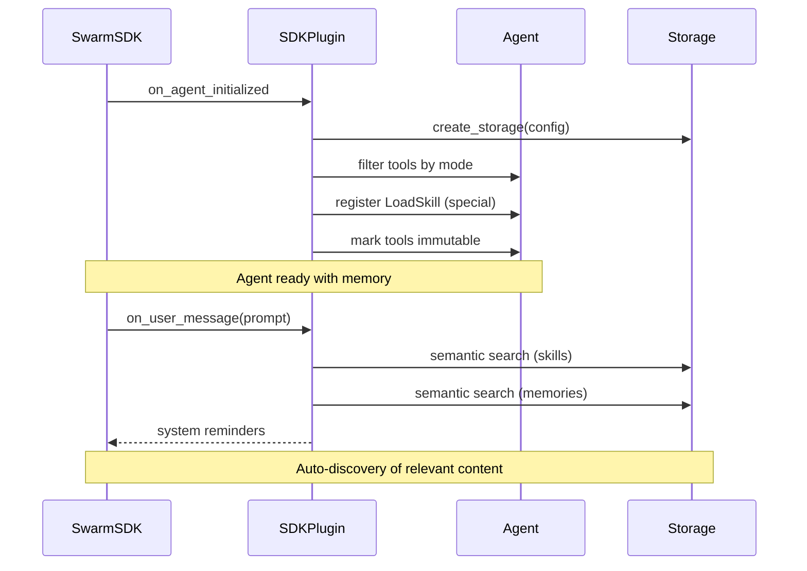

**Memory Modes:**

| Mode | Tools | Use Case |
|------|-------|----------|
| **assistant** (default) | Read, Glob, Grep, Write, Edit | Learning & retrieval |
| **retrieval** | Read, Glob, Grep | Read-only Q&A |
| **researcher** | All tools | Knowledge extraction |

**Mode-Based Tool Filtering:**
```ruby
def on_agent_initialized(agent_name:, agent:, context:)
  mode = extract_mode(context[:agent_definition].memory)
  allowed_tools = tools_for_mode(mode)

  # Remove tools not allowed in this mode
  all_memory_tools.each do |tool_name|
    agent.remove_tool(tool_name) unless allowed_tools.include?(tool_name)
  end

  # Register LoadSkill (unless read_only mode)
  unless mode == :retrieval
    load_skill = create_load_skill_tool(context)
    agent.with_tool(load_skill)
  end

  # Mark mode-specific tools as immutable
  agent.mark_tools_immutable(immutable_tools_for_mode(mode))
end
```

**Semantic Discovery on User Messages:**
```ruby
def on_user_message(agent_name:, prompt:, is_first_message:)
  # Adaptive threshold based on query length
  word_count = prompt.split.size
  threshold = word_count < 10 ? 0.25 : 0.35

  # Search 1: Skills (type="skill")
  skills = storage.semantic_index.search(
    query: prompt,
    top_k: 3,
    threshold: threshold,
    filter: { "type" => "skill" }
  )

  # Search 2: Memories (concept/fact/experience)
  memories = storage.semantic_index.search(
    query: prompt,
    top_k: 3,
    threshold: threshold,
    filter: { "type" => ["concept", "fact", "experience"] }
  )

  reminders = []
  reminders << build_skill_reminder(skills) if skills.any?
  reminders << build_memory_reminder(memories) if memories.any?
  reminders
end
```

**System Reminders:**
```
<system-reminder>
🎯 Found 2 skill(s) in memory that may be relevant:

**Debug API Errors** (82% match)
Path: `skill/debugging/api-errors.md`
To use: `LoadSkill(file_path: "skill/debugging/api-errors.md")`

**API Troubleshooting** (68% match)
Path: `skill/debugging/api-troubleshooting.md`
To use: `LoadSkill(file_path: "skill/debugging/api-troubleshooting.md")`

If a skill matches your task: Load it to get instructions.
If none match: Ignore and proceed normally.
</system-reminder>

<system-reminder>
📚 Found 3 memory entries that may provide context:

💡 **API Error Handling** (concept, 75% match)
Path: `concept/api/error-handling.md`
Read with: `MemoryRead(file_path: "concept/api/error-handling.md")`

📋 **API Documentation** (fact, 70% match)
Path: `fact/api/endpoints.md`
Read with: `MemoryRead(file_path: "fact/api/endpoints.md")`

🔍 **Fixed API Bug 2024** (experience, 65% match)
Path: `experience/api-bug-2024.md`
Read with: `MemoryRead(file_path: "experience/api-bug-2024.md")`

These entries may contain relevant knowledge for your task.
</system-reminder>
```

---

### Registration

**File:** `lib/swarm_memory/integration/registration.rb`

Auto-registers plugin with SwarmSDK when loaded.

```ruby
# In lib/swarm_memory.rb:
require_relative "swarm_memory/integration/registration"
SwarmMemory::Integration::Registration.register!

# Registration.register! does:
def register!
  return unless defined?(SwarmSDK)
  plugin = SDKPlugin.new
  SwarmSDK::PluginRegistry.register(plugin)
end
```

---

## DSL & Configuration

### MemoryConfig

**File:** `lib/swarm_memory/dsl/memory_config.rb`

Configuration object for agent memory.

**DSL Usage:**
```ruby
# In agent definition:
memory do
  adapter :filesystem             # Storage backend
  directory ".swarm/agent-memory" # Where to store
  mode :assistant                 # Tool mode
end
```

**Options:**
```ruby
# Adapter options (passed to adapter constructor):
option :namespace, "my_agent"
option :connection_pool_size, 5

# For filesystem adapter:
directory ".swarm/memory"  # Convenience for option :directory, ...
```

**Modes:**
- `:assistant` (default) - Read + Write + Edit
- `:retrieval` - Read-only
- `:researcher` - All tools

---

### BuilderExtension

**File:** `lib/swarm_memory/dsl/builder_extension.rb`

Injects `memory` DSL method into `SwarmSDK::Agent::Builder`.

```ruby
module BuilderExtension
  def memory(&block)
    @memory_config = SwarmMemory::DSL::MemoryConfig.new
    @memory_config.instance_eval(&block) if block_given?
    @memory_config
  end
end

# Automatically injected when SwarmMemory loads:
SwarmSDK::Agent::Builder.include(SwarmMemory::DSL::BuilderExtension)
```

**Usage in Agent Definition:**
```ruby
SwarmSDK.define do
  agent :researcher do
    memory do
      directory ".swarm/researcher-memory"
      mode :researcher  # All tools
    end

    tools :Read, :WebFetch, :Bash
    # Memory tools added automatically
  end
end
```

---

## CLI Commands

**File:** `lib/swarm_memory/cli/commands.rb`

Provides CLI for memory management.

**Commands:**

### 1. Setup Embeddings
```bash
swarm memory setup

# With custom model:
SWARM_MEMORY_EMBEDDING_MODEL=sentence-transformers/multi-qa-MiniLM-L6-cos-v1 \
  swarm memory setup
```

**What it does:**
- Downloads ONNX embedding model (~90MB)
- Caches to `~/.cache/huggingface/hub`
- One-time setup, then reused

---

### 2. Check Status
```bash
swarm memory status

# Output:
# SwarmMemory Embedding Status
# ==================================================
#
# Status: ✓ Model cached
# Model: sentence-transformers/multi-qa-MiniLM-L6-cos-v1
# Dimensions: 384
# Cache: /Users/user/.cache/huggingface/hub
#
# Semantic search is available.
```

---

### 3. Show Model Path
```bash
swarm memory model-path
# /Users/user/.cache/huggingface/hub
```

---

### 4. Defragment Memory
```bash
swarm memory defrag .swarm/assistant-memory

# Runs full analysis:
# - Health report
# - Find duplicates
# - Find low-quality entries
# - Find archival candidates
```

---

### 5. Rebuild Embeddings
```bash
swarm memory rebuild .swarm/assistant-memory

# With custom settings:
SWARM_MEMORY_EMBEDDING_MAX_CHARS=850 \
  swarm memory rebuild .swarm/assistant-memory

# Regenerates all embeddings (useful after model change)
```

---

## Skills System

### What are Skills?

Skills are **special memory entries** that:
- Provide step-by-step procedures
- Specify required tools
- Define tool permissions
- Can be loaded to **swap agent tools dynamically**

### Skill Structure

**Content (Markdown):**
```markdown
# Debug React Performance

## Prerequisites
- React DevTools installed
- Profiling enabled

## Steps

1. Open DevTools → Profiler tab
2. Click "Record"
3. Perform the slow interaction
4. Stop recording
5. Analyze flamegraph:
   - Look for wide bars (long renders)
   - Check component names
   - Identify render causes

## Common Causes
- Missing useMemo/useCallback
- Lifting state too high
- Expensive calculations in render
```

**Metadata (YAML sidecar):**
```yaml
title: Debug React Performance
type: skill
confidence: high
tags:
  - react
  - performance
  - debugging
  - profiling
related:
  - memory://concept/react/reconciliation.md
  - memory://skill/debugging/performance-general.md
domain: frontend/react
source: experimentation
tools:
  - Read
  - Edit
  - Bash
  - Grep
permissions:
  Bash:
    allowed_commands:
      - "^npm "
      - "^yarn "
  Write:
    denied_paths:
      - "src/secrets/**"
```

### Virtual Skills

Built-in skills that don't consume storage:
- `skill/meta/deep-learning.md` - Systematic learning protocol

**Deep Learning Protocol:**
```markdown
# Deep Learning Protocol

Use this when asked to learn deeply about a topic.

## Steps
1. Define Scope
2. Research Broadly (Overview)
3. Research Deeply (Specifics)
4. Build Practical Skills
5. Self-Test Understanding
6. Check Coverage (MemoryGrep)
7. Identify Knowledge Gaps
8. Fill Gaps
9. Verify Completion
10. Report Completion

## Success Criteria
- Have concepts (how it works)
- Have facts (specifics)
- Have skills (how to use)
- Can explain clearly
- Can apply practically
```

---

## Data Flow & Lifecycle

### Write Flow

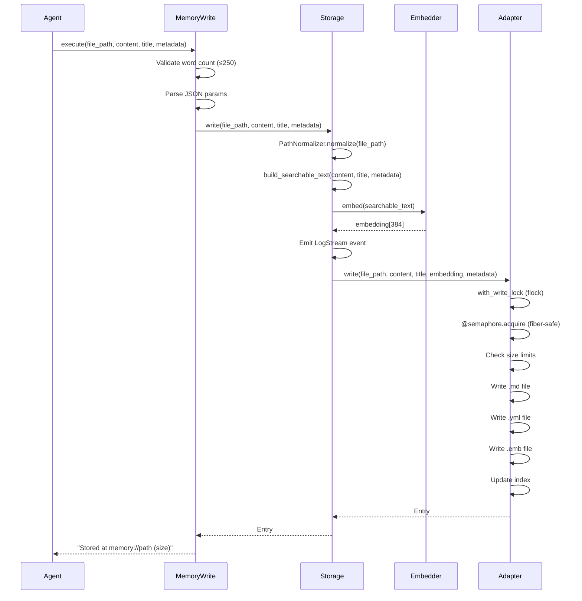

### Read Flow

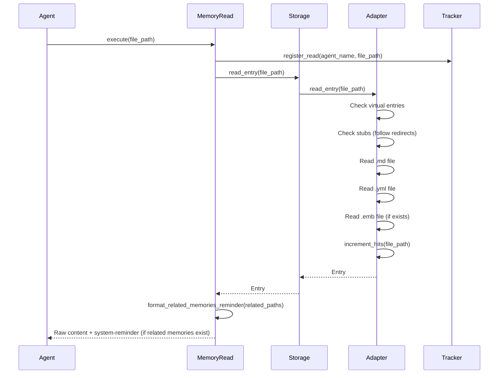

### Edit Flow

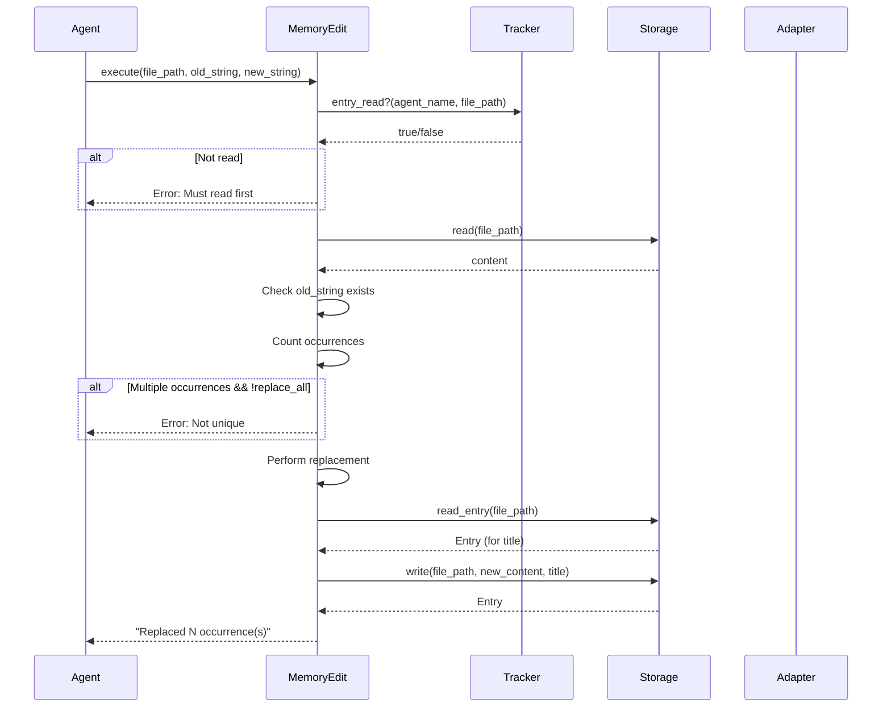

### Semantic Discovery Flow

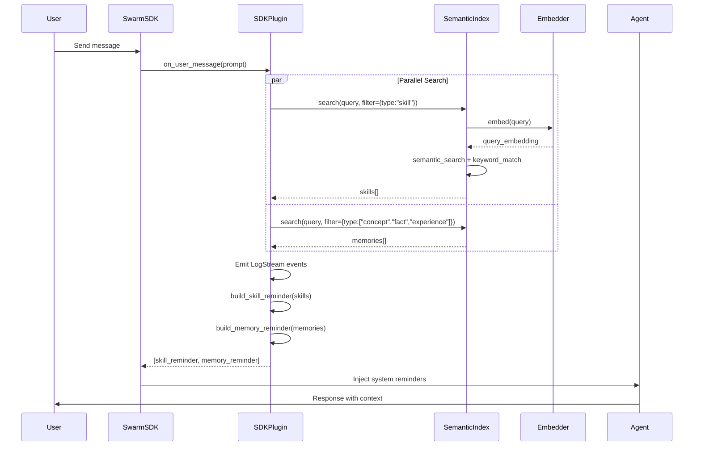

### LoadSkill Flow

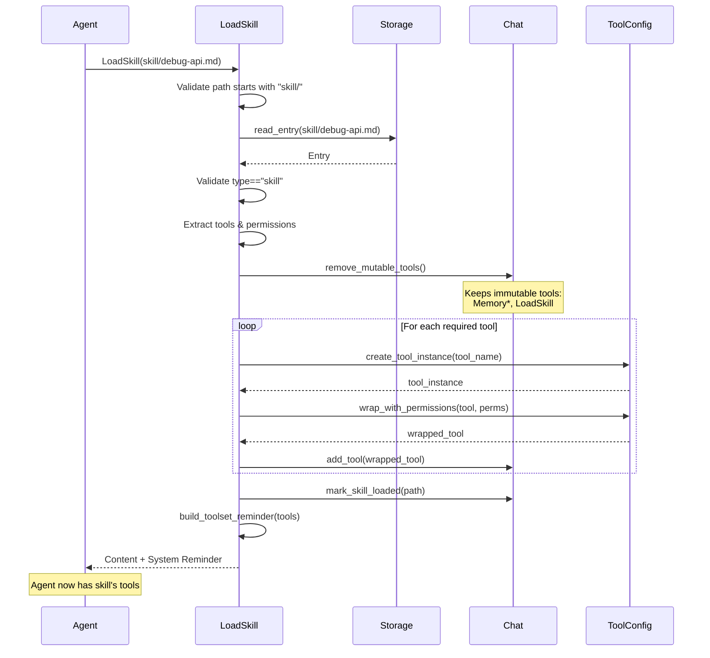

---

## Testing Strategy

### Test Structure

```
test/swarm_memory/
├── adapter_registry_test.rb
├── adapters/
│   ├── filesystem_adapter_test.rb
│   ├── file_locking_test.rb
│   └── virtual_entries_test.rb
├── core/
│   ├── entry_test.rb
│   ├── frontmatter_parser_test.rb
│   └── path_normalizer_test.rb
├── tools/
│   ├── memory_write_test.rb
│   ├── memory_read_test.rb
│   ├── memory_defrag_test.rb
│   └── load_skill_test.rb
├── integration/
│   ├── registration_test.rb
│   ├── swarm_sdk_integration_test.rb
│   └── skills_integration_test.rb
└── optimization/
    └── defragmenter_test.rb
```

### Test Helpers

**`swarm_memory_test_helper.rb`:**
```ruby
def create_temp_storage
  temp_dir = File.join(Dir.tmpdir, "test-storage-#{SecureRandom.hex}")
  adapter = SwarmMemory::Adapters::FilesystemAdapter.new(directory: temp_dir)
  embedder = SwarmMemory::Embeddings::InformersEmbedder.new
  SwarmMemory::Core::Storage.new(adapter: adapter, embedder: embedder)
end

def cleanup_storage(storage)
  FileUtils.rm_rf(storage.adapter.instance_variable_get(:@directory))
end
```

### Key Test Patterns

**1. Tool Execution Tests:**
```ruby
def test_write_entry_with_minimal_metadata
  result = @tool.execute(
    file_path: "test/simple.md",
    content: "Simple content",
    title: "Simple Entry",
    type: "fact",
    tags: ["test"],
    related: [],
    domain: "testing"
  )

  assert_match(%r{Stored at memory://test/simple.md}, result)
  entry = @storage.read_entry(file_path: "test/simple.md")
  assert_equal("Simple content", entry.content)
end
```

**2. Concurrency Tests:**
```ruby
def test_concurrent_writes
  threads = 10.times.map do |i|
    Thread.new do
      @adapter.write(
        file_path: "concurrent/entry-#{i}.md",
        content: "content #{i}",
        title: "Entry #{i}"
      )
    end
  end

  threads.each(&:join)
  assert_equal(10, @adapter.list(prefix: "concurrent").size)
end
```

**3. Integration Tests:**
```ruby
def test_swarm_sdk_integration
  swarm = SwarmSDK.define do
    agent :tester do
      memory do
        directory temp_memory_dir
        mode :assistant
      end
      tools :Read
    end
  end

  # Memory tools automatically added
  assert_includes(swarm.agent(:tester).tools.keys, :MemoryWrite)
end
```

---

## Environment Variables Reference

### Embedding Configuration

```bash
# Model selection (default: multi-qa-MiniLM-L6-cos-v1)
SWARM_MEMORY_EMBEDDING_MODEL=sentence-transformers/multi-qa-MiniLM-L6-cos-v1

# Searchable text length (default: 1200, -1 = unlimited)
SWARM_MEMORY_EMBEDDING_MAX_CHARS=1200
```

### Search Configuration

```bash
# Hybrid search weights (default: 0.5 each)
SWARM_MEMORY_SEMANTIC_WEIGHT=0.5
SWARM_MEMORY_KEYWORD_WEIGHT=0.5

# Adaptive thresholds (default: 0.35 normal, 0.25 short)
SWARM_MEMORY_DISCOVERY_THRESHOLD=0.35         # Normal queries
SWARM_MEMORY_DISCOVERY_THRESHOLD_SHORT=0.25   # Short queries
SWARM_MEMORY_ADAPTIVE_WORD_CUTOFF=10          # Cutoff for "short"
```

---

## Architecture Diagrams

### Component Layers

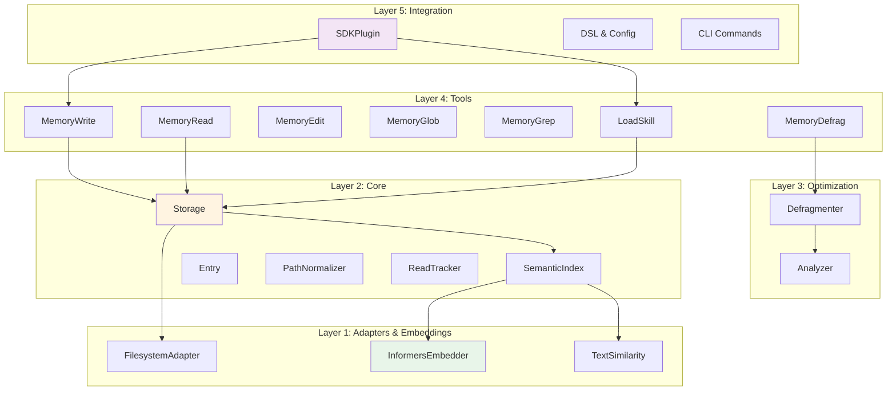

### File Organization

```
lib/swarm_memory/
├── swarm_memory.rb              # Entry point, auto-registration
├── version.rb                   # VERSION constant
├── errors.rb                    # Error classes
├── utils.rb                     # Utility methods
│
├── core/                        # Core system
│   ├── entry.rb                 # Entry struct
│   ├── storage.rb               # Orchestrator
│   ├── semantic_index.rb        # Hybrid search
│   ├── frontmatter_parser.rb    # YAML parsing
│   ├── metadata_extractor.rb    # Quality scoring
│   ├── path_normalizer.rb       # Path validation
│   └── storage_read_tracker.rb  # Read enforcement
│
├── adapters/                    # Storage backends
│   ├── base.rb                  # Abstract interface
│   └── filesystem_adapter.rb    # Real filesystem
│
├── embeddings/                  # Embedding generation
│   ├── embedder.rb              # Abstract interface
│   └── informers_embedder.rb    # ONNX-based
│
├── search/                      # Search implementations
│   ├── semantic_search.rb       # Embedding-based
│   ├── text_search.rb           # Glob/grep wrapper
│   └── text_similarity.rb       # Similarity metrics
│
├── tools/                       # Memory tools
│   ├── title_lookup.rb          # Shared module for title lookups
│   ├── memory_write.rb
│   ├── memory_read.rb
│   ├── memory_edit.rb
│   ├── memory_delete.rb
│   ├── memory_glob.rb
│   ├── memory_grep.rb
│   ├── memory_defrag.rb
│   └── load_skill.rb
│
├── optimization/                # Memory optimization
│   ├── analyzer.rb              # Health metrics
│   └── defragmenter.rb          # Optimization ops
│
├── integration/                 # SwarmSDK/CLI integration
│   ├── sdk_plugin.rb            # Plugin implementation
│   ├── registration.rb          # Auto-registration
│   ├── configuration.rb         # Config wrapper
│   └── cli_registration.rb      # CLI registration
│
├── dsl/                         # DSL for agent config
│   ├── memory_config.rb         # Config object
│   └── builder_extension.rb     # DSL injection
│
├── cli/                         # CLI commands
│   └── commands.rb              # swarm memory ...
│
├── chat_extension.rb            # Chat#remove_tool extension
│
├── prompts/                     # System prompts
│   ├── memory_assistant.md.erb
│   ├── memory_retrieval.md.erb
│   └── memory_researcher.md.erb
│
└── skills/                      # Built-in skills
    └── meta/
        ├── deep-learning.md
        └── deep-learning.yml
```

---

## Summary

SwarmMemory provides a complete **persistent memory system with semantic search** for SwarmSDK agents:

✅ **Hierarchical Storage** - 4 fixed categories: concept/, fact/, skill/, experience/
✅ **Hybrid Search** - Combines semantic similarity + keyword matching
✅ **Tool Swapping** - LoadSkill dynamically adapts agent capabilities
✅ **Memory Optimization** - Automated duplicate detection, linking, and cleanup
✅ **Plugin Architecture** - Clean integration with SwarmSDK
✅ **Semantic Discovery** - Auto-surfaces relevant skills and memories
✅ **Multiple Modes** - assistant/retrieval/researcher with different tool sets
✅ **CLI Management** - Setup, status, defrag, rebuild commands
✅ **Production Ready** - Thread-safe, fiber-safe, cross-process locking

**Key Innovations:**
- **250-word memory limit** forces focused, searchable entries
- **Read-before-edit enforcement** prevents blind modifications
- **Immutable tools** ensure memory tools never removed by LoadSkill
- **Adaptive thresholds** handle short and long queries differently
- **Virtual skills** provide meta-capabilities without storage cost

---

**End of Technical Reference**
